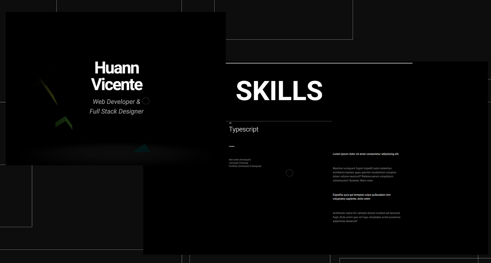
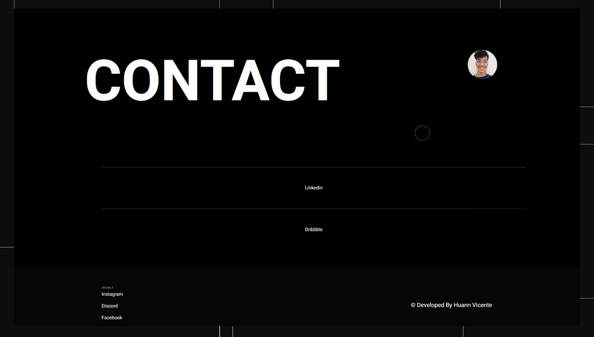

# mypersonalportifolio.io




## Production

[Deploy](#)

## Technologies

- **Framework:** Next.js 
- **Database:** MongoDB 
- **Deployment:** Vercel 

## Contact / Feedback 

Please if you see any problems, contact me, otherwise if you not see problem, least send me a feedback about code, structure oo anything, please contact me below:

Email me: mailto:huannvicente14@outlook.com

Connect with me at [Linkedin](https://www.linkedin.com/in/huann-vicente-5092a9261/)


## Running Locally

This application requires Node.js v16.13+.

```
  git clone 
  cd repo
  npm install
  npm run dev
```

